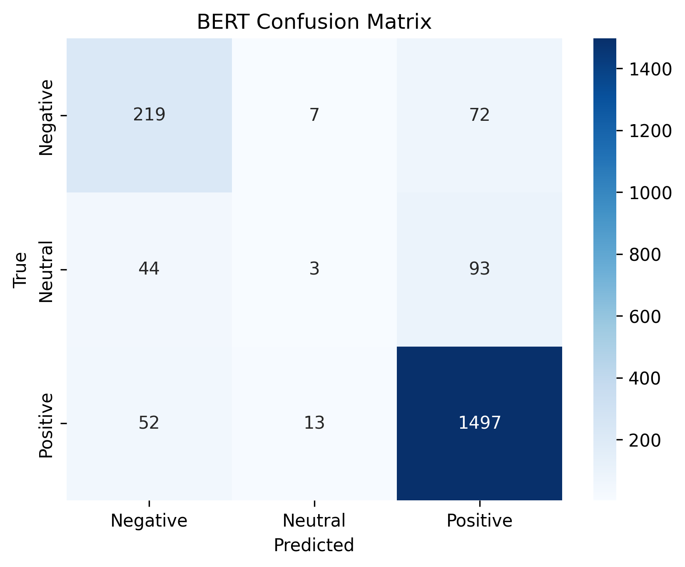

# Sentiment_Analysis_on_Customer_Reviews_Using_NLP
Natural Language Processing (NLP) Text Preprocessing Feature Extraction (TF-IDF, Word2Vec, GloVe) Deep Learning for NLP (RNNs, LSTMs, Transformers) Model Evaluation and Optimization
# Sentiment Analysis on Customer Reviews (Amazon)

Project: NLP pipeline to classify Amazon customer reviews into **Positive / Neutral / Negative**.

**Contents**
- `data/` — raw / processed datasets
- `scripts/`
  - `1_data_preprocessing.py`
  - `2_feature_extraction.py`
  - `3_model_training.py`
  - `4_prediction.py`
  - `5_eval_report.md`
- `notebooks/` — Colab notebook (end-to-end)
- `reports/` — evaluation_report.md, slides.md, confusion matrices images

## Quick summary
We trained and compared:
- Logistic Regression (TF-IDF) — baseline
- Random Forest, Linear SVM — classical baselines
- LSTM (Keras) — deep learning baseline
- BERT (Hugging Face) — transformer fine-tuning

**Best results (high-level):**
- Accuracy: ~86–87% for top models
- Neutral class remains challenging due to dataset imbalance
- Recommendations: oversampling, class weighting, more neutral data, or targeted fine-tuning

## How to run
1. Open `notebooks/amazon_sentiment_colab.ipynb` in Colab.
2. Follow top-to-bottom cells: install deps → download dataset → preprocess → train models → evaluate.
3. Scripts in `scripts/` replicate the same steps for running locally.

## License
CC0-1.0 (dataset license, check dataset source)

## Results Summary

| Model | Accuracy | Macro F1 |
|------|----------|----------|
| Logistic Regression (TF-IDF) | ~0.87 | ~0.57 |
| Random Forest | ~0.84 | ~0.56 |
| SVM | ~0.82 | ~0.61 |
| LSTM | ~0.86 | ~0.56 |
| BERT (fine-tuned on 10k samples) | ~0.86 | ~0.55 |

### Confusion Matrices

### LSTM Confusion Matrix

### BERT Confusion Matrix

**Key Observations**
- Positive sentiment is classified with high accuracy across all models
- Neutral sentiment is challenging due to class imbalance
- Deep learning and transformer models capture contextual information better

## Future Work

- Handle class imbalance using SMOTE or focal loss
- Improve Neutral sentiment classification
- Experiment with DistilBERT for faster inference
- Perform hyperparameter tuning for LSTM and Transformer models
- Deploy the model using FastAPI or Streamlit
